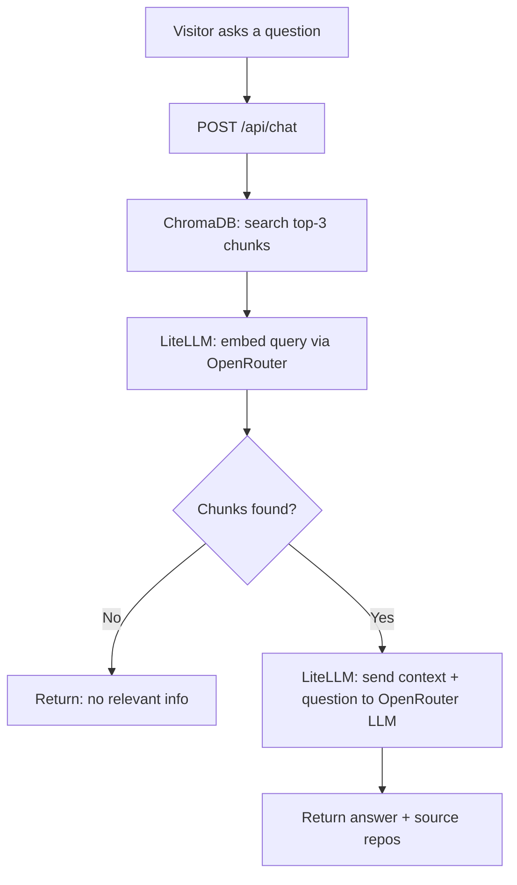
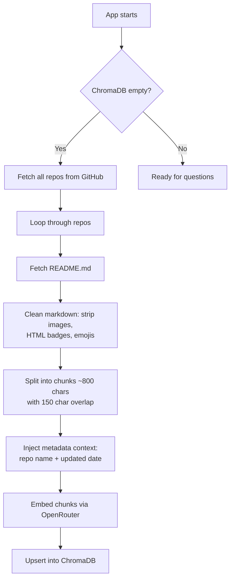
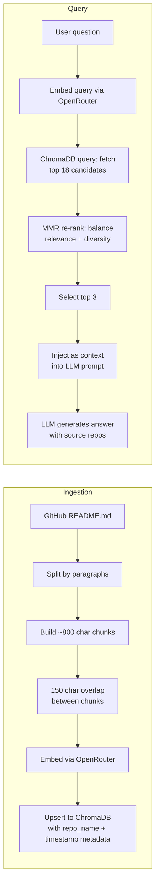

# ReadmeRag

A lightweight, zero-cost RAG (Retrieval-Augmented Generation) chatbot that answers questions about a developer's GitHub projects. It fetches README files from a GitHub profile, indexes them in a local vector database, and uses a free-tier LLM to answer questions.

---

## How It Works





---

## RAG Strategy



### Ingestion Details

| Step | How |
|---|---|
| **Text Splitting** | Paragraph-based. Accumulates paragraphs into ~800 char windows. |
| **Chunk Overlap** | Each chunk retains the last 150 chars of the previous chunk. Prevents context loss at boundaries. |
| **Chunk ID** | `{repo_name}_{index}_{md5(chunk[:60])}` — deterministic, no duplicates. |
| **Metadata** | Each chunk tagged with `repo_name` and `updated_at` ISO timestamp. |
| **Upsert** | ChromaDB's native upsert — same ID = safe re-index. No DB wipe needed. |

### Query Details

| Step | How |
|---|---|
| **Query Embedding** | User's question is embedded via LiteLLM/OpenRouter using the same embedding model. |
| **Candidate Fetch** | ChromaDB returns `n_results × 6 = 18` raw candidates (oversampling for diversity pool). |
| **MMR Re-rank** | Greedy algorithm picks 3 from the 18 candidates. Each pick maximizes: `λ × sim(query, chunk) − (1−λ) × max_sim(already_picked, chunk)`. At `λ = 0.5`, relevance and diversity are equally weighted. |
| **Context Injection** | Top 3 chunks are concatenated into a system prompt as README context. |
| **LLM Call** | Single-turn `completion()` call — no recursion, no multi-step chains. |
| **Fallback** | On 429 (rate limit) or timeout, returns a friendly message instead of crashing. |

---

## Markdown Preprocessing

Before chunking, every README passes through `clean_markdown_for_rag()` in `markdown_cleaner.py`. This ensures the LLM receives clean, semantic text rather than noisy HTML and images.

### Cleaner Steps

| Step | What | Example in → out |
|---|---|---|
| 1 | Strip Markdown images | `` → removed |
| 2 | Strip `<p>` badge containers (before removing their ``) | `<p></p>` → removed |
| 3 | Strip `<a>` badge links (before removing their ``) | `<a href="..."></a>` → removed |
| 4 | Strip remaining standalone `` tags | `` → removed |
| 5 | Strip empty HTML tags left from steps 2-3 | `<p></p>` → removed |
| 6 | Strip emojis (non-ASCII encode) | `🚀😊` → removed |
| 7 | Collapse whitespace | Multiple blank lines → single blank line |

### Metadata Injection

Each chunk has metadata appended to its visible text so the LLM can answer questions about recency and ownership:

```text
[some chunk text here...]

[Metadata: Repository=my-project, Last Updated=2026-06-15]
```

This means:
- **Vectors embed the metadata** — queries about "latest repo" or "your project" semantically match
- **The LLM sees the metadata** at the bottom of every context chunk
- **The date comes from GitHub's `updated_at` field**, not the ingestion timestamp

---

## Tech Stack

| Component | Choice | Why |
|---|---|---|
| Framework | FastAPI + Uvicorn | Async, lightweight, scale-to-zero friendly |
| Vector DB | ChromaDB (PersistentClient) | File-based, no server process, stores in `./chroma_db` |
| LLM Provider | OpenRouter (via LiteLLM) | Free-tier models, one API key for both chat + embeddings |
| Chat Model | `google/gemma-4-26b-a4b-it:free` | Free tier, capable reasoning |
| Embedding Model | `nvidia/llama-nemotron-embed-vl-1b-v2:free` | Free tier embedding |
| LLM Abstraction | LiteLLM | Provider-agnostic, drop-in model switching |
| Data Fetching | httpx (GitHub REST API) | Fetch repo list + raw README.md files |
| Re-ingestion | External cron (Render Cron Job / cron-job.org / GitHub Actions) | Daily `POST /api/ingest` keeps data fresh |
| Rate Limiting | slowapi | 5 requests/minute per IP on chat endpoint |
| Frontend | Vanilla HTML/CSS/JS | No build step, served as static files |

---

## Project Structure

```
ReadmeRiddle/
├── main.py              # FastAPI app, routes, static mount
├── github_client.py     # Fetch repos + READMEs via GitHub REST API
├── vector_engine.py     # ChromaDB persistence, chunking, upsert, search
├── llm_client.py        # LiteLLM wrapper for embeddings + chat completion
├── config.py            # Environment variable loading
├── .env.example         # Template — copy to .env and add keys
├── requirements.txt     # Python dependencies
├── static/
│   ├── index.html       # Chat UI
│   ├── style.css        # Dark-mode styling
│   └── app.js           # Frontend logic
└── chroma_db/           # Auto-created by PersistentClient (gitignored)
```

---

## Features

- **Automatic ingestion** — On first startup, fetches all public repos updated in the last 2 years and indexes their READMEs.
- **Daily re-ingestion via external cron** — A cron job calls `POST /api/ingest` once per day to keep data fresh. No in-process scheduler needed — works perfectly with scale-to-zero hosting.
- **Zero-cost architecture** — No cloud databases, no paid LLM tiers. ChromaDB is file-based. OpenRouter free-tier models handle both embeddings and chat.
- **Rate-limited chat** — 5 requests per minute per IP via slowapi to prevent abuse.
- **Graceful failure** — If the LLM provider returns 429 (quota exceeded) or times out, the API returns a friendly fallback message instead of crashing.
- **Deterministic RAG** — Single-turn, no recursive agent loops. Each query consumes at most one LLM call.
- **Source attribution** — Responses include which repos the answer was drawn from.
- **Manual re-ingestion** — `POST /api/ingest` triggers an immediate re-fetch and re-index.

---

## API Endpoints

| Method | Path | Description | Rate Limit |
|---|---|---|---|
| GET | `/` | Serve chat frontend | — |
| GET | `/api/health` | Health check + chunk count | — |
| POST | `/api/chat` | Ask a question | 5/min per IP |
| POST | `/api/ingest` | Manually trigger re-ingestion | — |

### POST /api/chat

**Request:**
```json
{ "query": "What is your project about?" }
```

**Response:**
```json
{
  "response": "The project is a ...",
  "sources": [
    { "repo": "my-project", "content_preview": "..." }
  ]
}
```

---

## Quick Setup

### Prerequisites
- Python 3.11+
- An OpenRouter account (free) — get an API key at [openrouter.ai/keys](https://openrouter.ai/keys)

### Install & Run

```bash
cd ReadmeRiddle
python -m venv .venv
source .venv/bin/activate
pip install -r requirements.txt
cp .env.example .env
```

Edit `.env` and add your OpenRouter API key:
```env
LITELLM_API_KEY=sk-or-v1-xxxxxxxxxxxxxxxx
```

Then start the server:
```bash
uvicorn main:app --host 0.0.0.0 --port 8000
```

The first startup will fetch all READMEs and index them. Open `http://localhost:8000` in a browser.

### Environment Variables

| Variable | Default | Description |
|---|---|---|
| `GITHUB_USERNAME` | `ridhwanrazaliwork` | GitHub profile to index |
| `GITHUB_TOKEN` | — | GitHub PAT (optional, ups rate limit from 60/hr to 5000/hr) |
| `LITELLM_API_KEY` | — | OpenRouter API key (required for both chat + embeddings) |
| `LITELLM_MODEL` | `openrouter/google/gemma-4-26b-a4b-it:free` | Chat model |
| `LITELLM_EMBEDDING_MODEL` | `openrouter/nvidia/llama-nemotron-embed-vl-1b-v2:free` | Embedding model |
| `CHROMA_DB_PATH` | `./chroma_db` | ChromaDB persistence directory |
| `CORS_ORIGINS` | `*` | Allowed origins (set to portfolio URL in production) |

---

## Integrating with a Next.js Portfolio

The FastAPI server runs as a separate process alongside your Next.js app. Two options:

**Option A — Embed the chat UI via iframe**
```html
<iframe src="https://your-fastapi-service.com/" width="400" height="600" />
```

**Option B — Call the API directly from a React component**
```tsx
const res = await fetch("https://your-fastapi-service.com/api/chat", {
  method: "POST",
  headers: { "Content-Type": "application/json" },
  body: JSON.stringify({ query: userQuestion }),
});
const data = await res.json();
```

---

## Deployment (scale-to-zero)

Designed for Render / GCP Cloud Run. Both support the Python/FastAPI pattern natively.

```dockerfile
FROM python:3.11-slim
WORKDIR /app
COPY requirements.txt .
RUN pip install -r requirements.txt
COPY . .
CMD ["uvicorn", "main:app", "--host", "0.0.0.0", "--port", "8000"]
```

**Note:** ChromaDB is file-based (`./chroma_db`). On scale-to-zero platforms, the directory resets on cold start unless mounted to persistent storage (Render Disk / Cloud Run Filestore). Without persistent storage, the DB re-populates on first request via the startup ingestion job.

### Daily Re-ingestion (External Cron)

There is no in-process scheduler. Instead, an external cron job calls `POST /api/ingest` once per day. This pattern is cleaner for scale-to-zero because:

- **No need to keep the app alive** just for a scheduler timer
- The cron wakes the app → ingestion runs → response returns
- Works with free cron providers

Choose one option:

#### Option A — Render Cron Job (recommended if deploying on Render)

Render has a built-in **Cron Job** service type. Create one alongside your web service:

1. In the Render dashboard, click **New +** → **Cron Job**
2. Set **Schedule** to `0 0 * * *` (once daily at midnight)
3. Set **Command** to:
   ```bash
   curl -X POST https://your-app.onrender.com/api/ingest
   ```
4. No persistent disk needed — the cron just triggers the endpoint

#### Option B — cron-job.org (free, no account required for simple use)

1. Go to [cron-job.org](https://cron-job.org)
2. Create a job that `POST`s to `https://your-app.onrender.com/api/ingest`
3. Set interval: once per day

#### Option C — GitHub Actions

```yaml
# .github/workflows/daily-ingest.yml
name: Daily Ingest
on:
  schedule:
    - cron: "0 0 * * *"
jobs:
  ingest:
    runs-on: ubuntu-latest
    steps:
      - run: curl -X POST https://your-app.onrender.com/api/ingest
```

### Keeping the App Warm for Chat

Use **UptimeRobot** (free) to ping `https://your-app.onrender.com/api/health` every 13 minutes. This prevents Render from spinning down so visitors get instant responses when they chat.

**Important:** UptimeRobot pings `GET /api/health` — it does **not** trigger ingestion. Only `POST /api/ingest` triggers re-ingestion.

---

## License

MIT
