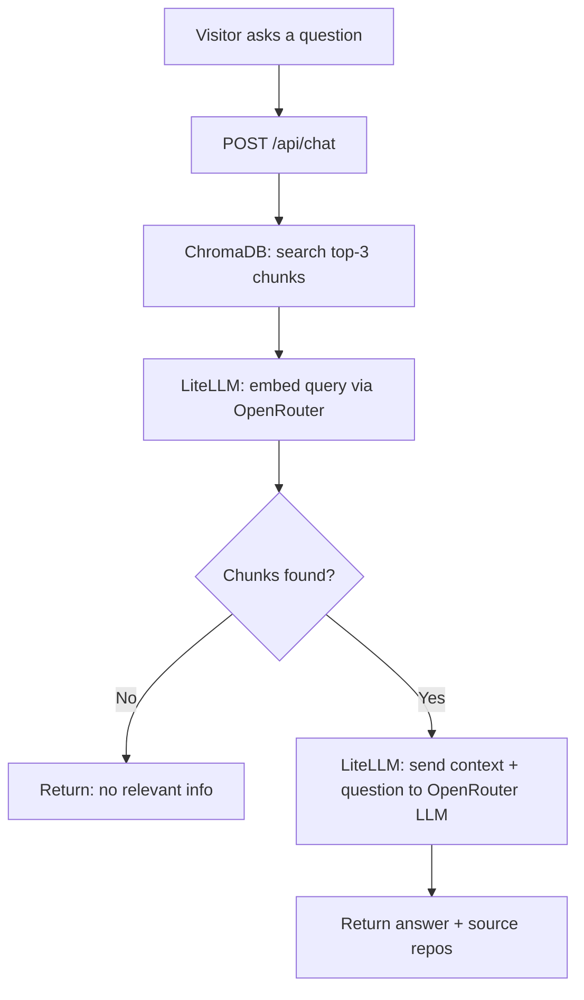
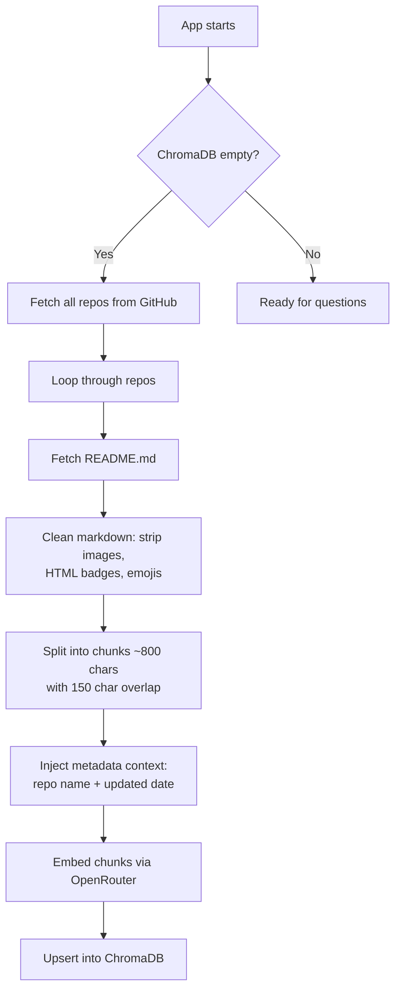
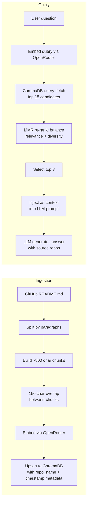

# ReadmeRag

A lightweight, zero-cost RAG (Retrieval-Augmented Generation) chatbot that answers questions about a developer's GitHub projects. It fetches README files from a GitHub profile, indexes them in a local vector database, and uses a free-tier LLM to answer questions.

---

## How It Works





---

## RAG Strategy



### Ingestion Details

| Step | How |
|---|---|
| **Text Splitting** | Paragraph-based. Accumulates paragraphs into ~800 char windows. |
| **Chunk Overlap** | Each chunk retains the last 150 chars of the previous chunk. Prevents context loss at boundaries. |
| **Chunk ID** | `{repo_name}_{index}_{md5(chunk[:60])}` — deterministic, no duplicates. |
| **Metadata** | Each chunk tagged with `repo_name` and `updated_at` ISO timestamp. |
| **Upsert** | ChromaDB's native upsert — same ID = safe re-index. No DB wipe needed. |

### Query Details

| Step | How |
|---|---|
| **Query Embedding** | User's question is embedded via LiteLLM/OpenRouter using the same embedding model. |
| **Candidate Fetch** | ChromaDB returns `n_results × 6 = 18` raw candidates (oversampling for diversity pool). |
| **MMR Re-rank** | Greedy algorithm picks 3 from the 18 candidates. Each pick maximizes: `λ × sim(query, chunk) − (1−λ) × max_sim(already_picked, chunk)`. At `λ = 0.5`, relevance and diversity are equally weighted. |
| **Context Injection** | Top 3 chunks are concatenated into a system prompt as README context. |
| **LLM Call** | Single-turn `completion()` call — no recursion, no multi-step chains. |
| **Fallback** | On 429 (rate limit) or timeout, returns a friendly message instead of crashing. |

---

## Markdown Preprocessing

Before chunking, every README passes through `clean_markdown_for_rag()` in `markdown_cleaner.py`. This ensures the LLM receives clean, semantic text rather than noisy HTML and images.

### Cleaner Steps

| Step | What | Example in → out |
|---|---|---|
| 1 | Strip Markdown images | `` → removed |
| 2 | Strip `<p>` badge containers (before removing their ``) | `<p></p>` → removed |
| 3 | Strip `<a>` badge links (before removing their ``) | `<a href="..."></a>` → removed |
| 4 | Strip remaining standalone `` tags | `` → removed |
| 5 | Strip empty HTML tags left from steps 2-3 | `<p></p>` → removed |
| 6 | Strip emojis (non-ASCII encode) | `🚀😊` → removed |
| 7 | Collapse whitespace | Multiple blank lines → single blank line |

### Metadata Injection

Each chunk has metadata appended to its visible text so the LLM can answer questions about recency and ownership:

```text
[some chunk text here...]

[Metadata: Repository=my-project, Last Updated=2026-06-15]
```

This means:
- **Vectors embed the metadata** — queries about "latest repo" or "your project" semantically match
- **The LLM sees the metadata** at the bottom of every context chunk
- **The date comes from GitHub's `updated_at` field**, not the ingestion timestamp

---

## Design Rationale

Every feature exists to solve a specific problem with zero-cost constraints:

| Feature | Problem It Solves |
|---|---|
| **Overlap chunking (150 chars)** | Prevents context loss at chunk boundaries. Without it, a question spanning two adjacent paragraphs gets only one half |
| **MMR diversity** | Without it, all 3 results come from the same README. MMR ensures context spans multiple repos |
| **Hybrid BM25 + Dense search** | Dense embeddings miss exact technical terms ("CUDA", "PostgreSQL"). BM25 catches them, RRF fuses both |
| **Markdown sanitizer** | GitHub READMEs contain images, badges, emojis — noise that dilutes embedding quality and produces ugly LLM output |
| **Metadata injection** | Lets the LLM see which repo each chunk came from and when it was last updated — enables "latest repo?" questions |
| **Time metadata filtering** | When a user asks "latest repo", restricts candidate pool to repos updated in the last 6 months so the LLM can't pick wrong |
| **Short-term memory (5 turns)** | Without it, follow-up questions like "which one is newest?" have zero context. ~1K extra tokens, trivial on a 1M context model |
| **Project catalog** | "List all your repos" can't be answered by top-3 chunk search. Deduplicates metadata from ChromaDB for a complete project overview |
| **Personal bio routing** | Profile README has resume content. When users ask about experience/skills, search targets bio chunks exclusively |
| **Orphan repo cleanup** | Renamed or deleted GitHub repos leave stale chunks in ChromaDB. Detects and removes them on every ingestion |
| **2-year cutoff** | Only indexes repos updated since 2024. Prevents indexing stale abandoned projects |
| **External cron re-ingestion** | No in-process scheduler. Scale-to-zero friendly — cron wakes the app, ingestion runs, app goes back to sleep |
| **5 req/min rate limit** | Prevents abuse of free-tier LLM credits. slowapi enforces per-IP throttling on `/api/chat` |

---

## Tech Stack

| Component | Choice | Why |
|---|---|---|
| Framework | FastAPI + Uvicorn | Async, lightweight, scale-to-zero friendly |
| Vector DB | ChromaDB (PersistentClient) | File-based, no server process, stores in `./chroma_db` |
| LLM Provider | OpenRouter (via LiteLLM) | Free-tier models, one API key for both chat + embeddings |
| Chat Model | `google/gemini-2.5-flash-lite` | 1M context window, fast, cheap |
| Embedding Model | `qwen3-embedding-8b` | Efficient 8B param embedding model |
| LLM Abstraction | LiteLLM | Provider-agnostic, drop-in model switching |
| Data Fetching | httpx (GitHub REST API) | Fetch repo list + raw README.md files |
| Re-ingestion | External cron (Render Cron Job / cron-job.org / GitHub Actions) | Daily `POST /api/ingest` keeps data fresh |
| Rate Limiting | slowapi | 5 requests/minute per IP on chat endpoint |
| Frontend | Vanilla HTML/CSS/JS | No build step, served as static files |

---

## Project Structure

```
ReadmeRiddle/
├── main.py              # FastAPI app, routes, static mount
├── github_client.py     # Fetch repos + READMEs via GitHub REST API
├── vector_engine.py     # ChromaDB persistence, chunking, upsert, search
├── markdown_cleaner.py  # Strips images, badges, emojis from markdown
├── llm_client.py        # LiteLLM wrapper for embeddings + chat completion
├── config.py            # Environment variable loading
├── pyproject.toml       # Project metadata + dependencies (uv)
├── uv.lock              # Lockfile (auto-generated by uv)
├── .env.example         # Template — copy to .env and add keys
├── static/
│   ├── index.html       # Chat UI
│   ├── style.css        # Dark-mode styling
│   └── app.js           # Frontend logic
├── tests/
│   └── test_markdown_cleaner.ipynb
└── chroma_db/           # Auto-created by PersistentClient (gitignored)
```

---

## Features

- **Automatic ingestion** — On first startup, fetches all public repos updated in the last 2 years and indexes their READMEs.
- **Daily re-ingestion via external cron** — A cron job calls `POST /api/ingest` once per day to keep data fresh. No in-process scheduler needed — works perfectly with scale-to-zero hosting.
- **Zero-cost architecture** — No cloud databases, no paid LLM tiers. ChromaDB is file-based. OpenRouter free-tier models handle both embeddings and chat.
- **Rate-limited chat** — 5 requests per minute per IP via slowapi to prevent abuse.
- **Graceful failure** — If the LLM provider returns 429 (quota exceeded) or times out, the API returns a friendly fallback message instead of crashing.
- **Short-term memory** — Remembers the last 5 conversation turns so follow-up questions like "which one?" have context.
- **Time-aware search** — When asked about "latest" or "newest" projects, restricts results to recently updated repos via metadata filtering.
- **Project catalog** — Answers "list all your repos" or "list ETL projects" using a deduplicated repo description catalog instead of chunk search.
- **Personal bio routing** — When asked about experience, education, or skills, routes the query exclusively to the profile README chunks.
- **Source attribution** — Responses include which repos the answer was drawn from.
- **Manual re-ingestion** — `POST /api/ingest` triggers an immediate re-fetch and re-index.

---

## API Endpoints

| Method | Path | Description | Rate Limit |
|---|---|---|---|
| GET | `/` | Serve chat frontend | — |
| GET | `/api/health` | Health check + chunk count | — |
| POST | `/api/chat` | Ask a question | 5/min per IP |
| POST | `/api/ingest` | Manually trigger re-ingestion | — |

### POST /api/chat

**Request:**
```json
{ "query": "What is your project about?" }
```

**Response:**
```json
{
  "response": "The project is a ...",
  "sources": [
    { "repo": "my-project", "content_preview": "..." }
  ]
}
```

---

## Quick Setup

### Prerequisites
- Python 3.11+
- An OpenRouter account (free) — get an API key at [openrouter.ai/keys](https://openrouter.ai/keys)

### Install & Run

Requires [uv](https://docs.astral.sh/uv/) (install once: `curl -LsSf https://astral.sh/uv/install.sh | sh`).

```bash
cd ReadmeRiddle
uv sync
cp .env.example .env
```

Edit `.env` and add your OpenRouter API key:
```env
LITELLM_API_KEY=sk-or-v1-xxxxxxxxxxxxxxxx
```

Then start the server:
```bash
uv run uvicorn main:app --host 0.0.0.0 --port 8000
```

The first startup will fetch all READMEs and index them. Open `http://localhost:8000` in a browser.

### Environment Variables

| Variable | Default | Description |
|---|---|---|
| `GITHUB_USERNAME` | `ridhwanrazaliwork` | GitHub profile to index |
| `GITHUB_TOKEN` | — | GitHub PAT (optional, ups rate limit from 60/hr to 5000/hr) |
| `LITELLM_API_KEY` | — | OpenRouter API key (required for both chat + embeddings) |
| `LITELLM_MODEL` | `openrouter/google/gemini-2.5-flash-lite` | Chat model |
| `LITELLM_EMBEDDING_MODEL` | `openrouter/qwen3-embedding-8b` | Embedding model |
| `CHROMA_DB_PATH` | `./chroma_db` | ChromaDB persistence directory |
| `CORS_ORIGINS` | `*` | Allowed origins (set to portfolio URL in production) |

---

## Integrating with a Next.js Portfolio

The FastAPI server runs as a separate process alongside your Next.js app. Two options:

**Option A — Embed the chat UI via iframe**
```html
<iframe src="https://your-fastapi-service.com/" width="400" height="600" />
```

**Option B — Call the API directly from a React component**
```tsx
const res = await fetch("https://your-fastapi-service.com/api/chat", {
  method: "POST",
  headers: { "Content-Type": "application/json" },
  body: JSON.stringify({ query: userQuestion }),
});
const data = await res.json();
```

---

## Deployment

The app is designed to run on Render (backend) alongside a Vercel-hosted Next.js portfolio (frontend).

### Architecture

```
Vercel (Portfolio)                    Render (ReadmeRag)
┌──────────────────┐     CORS     ┌─────────────────────┐
│  ridhwanrazali.dev │───────────→│ readmerag.onrender.com │
│  Next.js + chat   │  POST      │ FastAPI + ChromaDB   │
│  widget           │  /api/chat │ uvicon                │
└──────────────────┘  /stream    └─────────────────────┘
                                          │
                                ┌─────────┴──────────┐
                                │  Render Cron Job    │
                                │  POST /api/ingest    │
                                │  1x daily            │
                                └─────────────────────┘
```

### Render Web Service Setup

1. **Create a Web Service** in the Render dashboard
2. **Connect your GitHub repo** (`readmerag`)
3. **Build**: Dockerfile (auto-detected)
4. **Port**: 8000
5. **Health check**: `/api/health`

#### Environment Variables (Render Panel)

| Variable | Value |
|---|---|
| `GITHUB_USERNAME` | `ridhwanrazaliwork` |
| `GITHUB_TOKEN` | `github_pat_...` |
| `LITELLM_API_KEY` | `sk-or-v1-...` |
| `LITELLM_MODEL` | `openrouter/google/gemini-2.5-flash-lite` |
| `LITELLM_EMBEDDING_MODEL` | `openrouter/qwen3-embedding-8b` |
| `CORS_ORIGINS` | `https://ridhwanrazali.dev,http://localhost:3000` |
| `LITELLM_DEBUG` | `false` |
| `CHROMA_DB_PATH` | `/data/chroma_db` (if using persistent disk) |

#### Dockerfile (included in repo)

```dockerfile
FROM python:3.11-slim
COPY --from=ghcr.io/astral-sh/uv:latest /uv /uvx /bin/
WORKDIR /app
COPY pyproject.toml uv.lock ./
RUN uv sync --no-dev --frozen
COPY . .
EXPOSE 8000
CMD ["uv", "run", "uvicorn", "main:app", "--host", "0.0.0.0", "--port", "8000"]
```

#### Persistent Disk (Recommended)

Attach a Render Disk to persist ChromaDB between deploys:
- **Mount path**: `/data`
- **Env var**: `CHROMA_DB_PATH=/data/chroma_db`

Without a disk, `chroma_db/` resets on every deploy and must re-ingest on cold start.

### Cron Job (Daily Re-ingestion)

Render has a built-in **Cron Job** service type:

1. **New +** → **Cron Job**
2. **Schedule**: `0 0 * * *` (once daily)
3. **Command**:
   ```bash
   curl -X POST https://readmerag.onrender.com/api/ingest
   ```

### Keeping the App Warm

Use **UptimeRobot** (free) to prevent Render from spinning down:

- **Monitor**: `https://readmerag.onrender.com/api/health`
- **Interval**: 13 minutes

Pings hit `GET /api/health` — they do **not** trigger ingestion. Only `POST /api/ingest` triggers it.

### Next.js Widget Integration (Vercel)

The FastAPI backend exposes two chat endpoints. The portfolio on Vercel should use the streaming endpoint for a real-time experience:

```tsx
// components/ChatWidget.tsx
const res = await fetch("https://readmerag.onrender.com/api/chat/stream", {
  method: "POST",
  headers: { "Content-Type": "application/json" },
  body: JSON.stringify({
    query: userMessage,
    history: last10Messages,   // last 5 user/assistant pairs
  }),
});

// Read token-by-token via SSE
const reader = res.body!.pipeThrough(new TextDecoderStream()).getReader();
while (true) {
  const { done, value } = await reader.read();
  if (done) break;
  for (const line of value.split("\n")) {
    if (line.startsWith("data: ")) {
      const payload = line.slice(6);
      if (payload === "[DONE]") break;
      const { token } = JSON.parse(payload);
      setChatText(prev => prev + token);
    }
  }
}
```

For a simpler non-streaming integration:

```tsx
const res = await fetch("https://readmerag.onrender.com/api/chat", {
  method: "POST",
  headers: { "Content-Type": "application/json" },
  body: JSON.stringify({ query: userMessage, history: last10Messages }),
});
const data = await res.json();
setResponse(data.response);  // full text at once
```

#### CORS Configuration

Set `CORS_ORIGINS=https://ridhwanrazali.dev,http://localhost:3000` in Render env vars. The code reads from the env var — not hardcoded.

---

## License

MIT
